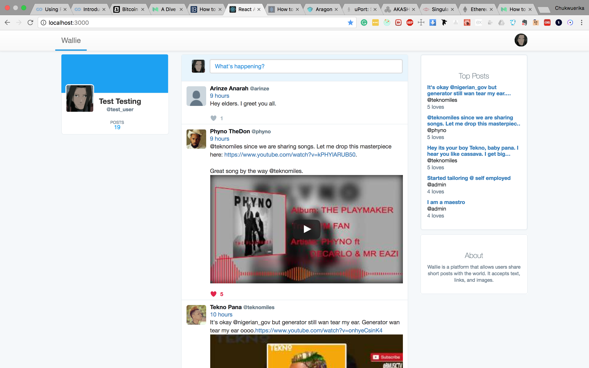

# Wallie
> A message board for all humans.


This is a message/post board built with react. Users can share texts, images and embedded links and all other users on the site (both authenticated or unauthenticated) would be able to view them. __Nothing is private here!__

To run this project locally, you will need to also download the [API portion](https://github.com/andela-cdike/wall-app-api), also hosted on github.


## Screenshot


## Technologies
+ [React](https://facebook.github.io/react/)
+ [Redux](http://redux.js.org/)
+ [Reconnecting Websockets](https://github.com/pladaria/reconnecting-websocket)
+ [React Bootstrap](https://react-bootstrap.github.io/)
+ [Jest](http://facebook.github.io/jest/)
+ [Enzyme](http://airbnb.io/enzyme/index.html)

## Pre-requisites
+ Node
+ npm

## Installation

1. Clone the repo:

```sh
$ git clone https://github.com/andela-cdike/wallie.git
```

2. Navigate to root folder

```sh
$ cd wallie
```

3. Install dependencies

```sh
$ npm install
    or
$ yarn
```

4. Run the server

```sh
$ npm start -s
$ yarn start -s
```


## Tests
Run tests with

```sh
$ npm run test
    or
$ yarn test
```

## Meta

Erika Dike – [@rikkydyke](https://twitter.com/rikkydyke) – chukwuerikadike@gmail.com

## License
Distributed under the MIT license. See ``LICENSE`` for more information.
